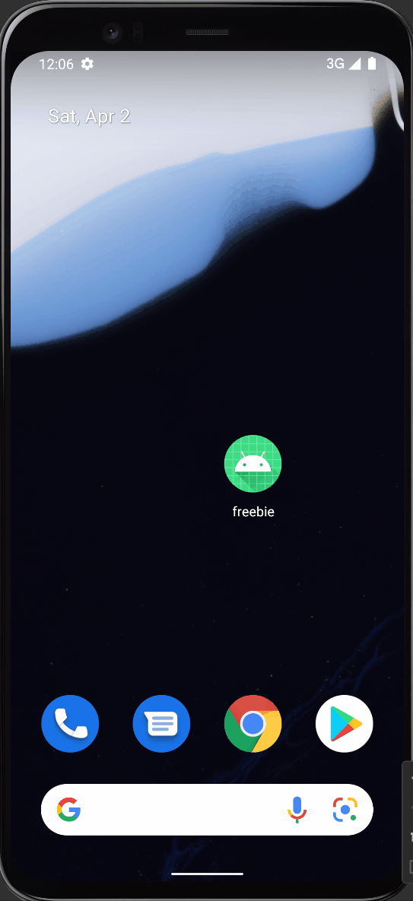

Freebie Music Player - README
===

# Freebie

## Table of Contents
1. [Overview](#Overview)
1. [Product Spec](#Product-Spec)
1. [Wireframes](#Wireframes)
2. [Schema](#Schema)

## Overview
### Description
Basic local music player

### App Evaluation
[Evaluation of your app across the following attributes]
- **Category:** Entertainment
- **Mobile:** This app will be exclusively designed for mobile.
- **Market:** People who want to listen to music offline or avoid subscription music services
- **Scope:**

## Product Spec

### 1. User Stories (Required and Optional)

**Required Must-have Stories**

* Now playing screen 
    [x] Album art
    [x] Play/pause (shuffle, repeat?)
    [x] Song's name

* Home page (recycler view)
    * List of songs

* Album page
    * List of albums with album art
    
* Artist page
    * Artist profile

**Optional Nice-to-have Stories**

* take average or primary color of the album art and apply it as the theme of the app
* Lyrics
* navigation buttons
    * Liked songs
    * List of Albums accessible via NavBar
    * List of Artists accessible via NavBar
    * List of Genres accessible via NavBar
* Settings menu
    * dark mode/light mode
    * block explicit songs
    * default queue order (alpha, chrono, last played)
    * Enable gapless playback
    * Default tab (tracks, albums, etc)
* Artist descriptions provided by last.fm
* shuffle/repeat buttons
* crossfade
* visualizer (waveform, frequency graph, colorful animation)

### 2. Screen Archetypes

* Home Screen - Stream
   * Screen with list of songs
* Now playing - Detail
    * Album art
    * Play/Pause
    * Song's name 

### 3. Navigation

**Tab Navigation** (Tab to Screen)

* Home 
* Albums
* Artists
* Settings

**Flow Navigation** (Screen to Screen)

* Home/Albums/Artists
   * transition to now playing

## Wireframes
[Add picture of your hand sketched wireframes in this section]

## Schema 
### Models
#### Song
   | Property      | Type     | Description |
   | ------------- | -------- | ------------|
   | songName      | String   | holds name of the song |
   | liked         | boolean| tells whether this song has been liked or not |
   | genre         | String | holds genre of the song |
   | artist        | String | holds name of the artist |
   | playCount     | int    | holds number of times the song has been played |

#### Album
   | Property      | Type     | Description |
   | ------------- | -------- | ------------|
   | albumName     | String   | holds name of the album |
   | liked         | boolean  | tells whether this album has been liked or not |
   | genre         | String | holds genre of the album |
   | artist        | String | holds name of the artist |
   
#### Artist
   | Property      | Type     | Description |
   | ------------- | -------- | ------------|
   | artistName    | String   | holds name of the artist |
   | liked         | boolean  | tells whether this artist has been liked or not |
   | playCount     | int    | holds number of times songs from this artist have been played |

## Networking
### Last.fm
#### https://www.last.fm/api

** Week 7 Demo **

** Final demo gif**
 

